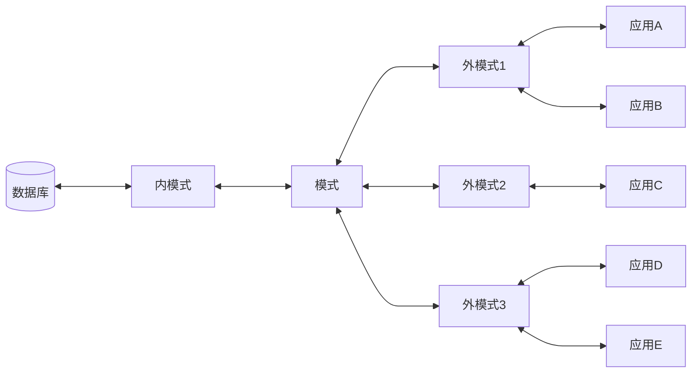

> 感觉精力都花在了读中文语句上了
> 
> 推荐以下三个别的教学，
> - [CS186](https://www.bilibili.com/video/BV13a411c7Qo)
> - [CMU 15-445](https://15445.courses.cs.cmu.edu/fall2020/schedule.html#)
>  - [SQL](https://www.bilibili.com/video/BV1UE41147KC)

## 第 1 章 绪论

### 1.1 数据库系统概述

#### 1.1.1 四个基本概念

数据库 ： 数据库是长期存储在计算机内、有组织的、可共享的大量数据的集合。数据库中的数据按一定的数据模型组织、描述和储存，冗余度低、数据独立性强、易扩展，并可为用户共享。

简易而言，数据库具有永久存储、有组织和共享三个特点。

#### 1.1.3 数据库的特点

数据独立性

- 物理独立性：用户的应用程序与数据相互独立
- 逻辑独立性：用户的应用程序与数据库的结构是相互独立的

### 1.2 数据模型

#### 1.2.1 两类数据模型

数据模型一般只有两种

1. 概念模型
2. 逻辑模型与物理模型

概念模型又被称作为信息模型，它是按照用户的观点对数据和信息建模，用于数据库设计。

逻辑模型，主要包括各种数据结构，用于数据库管理系统的实现

物理模型一般是实际在计算机中的表示与存储，通常使用者不需要关注这层。

#### 1.2.2 概念模型

概念模型是对现实世界的一次抽象。通常我们需要有以下几种概念。

1. 实体

   客观存在且相互区别的事务称为实体

2. 属性

3. 码(key)

   可以表示出这个实体的唯一标识，通常改标识为一个或者多个属性

4. 实体型

   通过一些属性进行划分出的同类事物

概念模型的一种表示方法：实体(entity)-联系(relationship)方法.

通常可以用 E-R 图的方式表示。

#### 1.2.3 数据模型的组成要素

主要有三个要素

1. 数据结构

   数据结构描述数据库的组成对象以及对象之间的联系

2. 数据操作

3. 完整性约束

#### 1.2.4 常用的数据结构

在数据库的领域中主要的逻辑数据模型有：

- 层次模型
- 网状模型
- 关系模型
- 面向对象数据模型
- 对象关系数据模型
- 半结构化数据模型

#### 1.2.5 层次模型

层次模型在数据库中的定义满足下面两个基本层次联系的集合为层次模型

- 有一个根结点
- 是一种典型的树形结构

在层次结构中，我们的插入必须满足其父节点一定存在的原则，否则将会插入失败。

层次模型主要有以下的优缺点

- 结构清晰简单
- 查询效率高
- 完整性较高(一棵树就是一个独立的个体)

缺点

- 很多联系并非简单的一对多的关系
- 查询的时候必须知道其路径如何

#### 1.2.6 网状结构

相较于树形结构，网状结构采用图的形式进行存储。

完整性约束

- 可有通过码来相互访问
- 保证关系可以多对多
- 可以加入类树形结构的约束条件

优点

- 可以直接模拟现实
- 性能较高

缺点

- 实现复杂
- 对于用户而言关系复杂，不易使用

#### 1.2.7 关系模型的数据结构

关系模型表现为一个二维表

因此出现下面的一些表格上的术语 

- 关系 -- 一张表
- 元组 ： 每一行称为一个元组
- 属性 ：  每一列都是属性
- 码 ： 某个或某些属性，通过这些属性可以唯一定位一个元组
- 域 ： 一组具有相同数据类型的集合
- 分量 ： 元组中的一个属性值
- 关系模式 ： 关系模型(属性1...n)

优点

- 概念简单易懂，使用方便
- 数据相对存简单

缺点

- 效率并不是很高

### 1.3 数据库系统的结构

#### 1.3.1 数据库系统模式的概念

通常，我们针对某一具体的数据存储它具有两个特征。

对于其中存储的数据而言，我们通常称之为实例，一个实例可能随着时间的变化而变动，但其总体上存储的模式并未改变。

换句话说，模式就是逻辑结构。

#### 1.3.2 数据库系统的三级模式结构

一个通常的数据库模式是由外模式、模式和内模式三级构成。

1. 模式

   模式也称作为逻辑模式，是逻辑特征的描述

2. 外模式

   外模式又可称作为用户模式，他是用户所能看见的局部模式。

3. 内模式

   内模式也称为存储模式，通常一个数据库只会有一个内模式。通常其为数据的物理结构域存储方式的描述。

### 1.4 数据库系统的组成

1. 硬件平台及数据库
2. 软件
3. 人员
   1. 用户
   2. 程序员
   3. 管理员