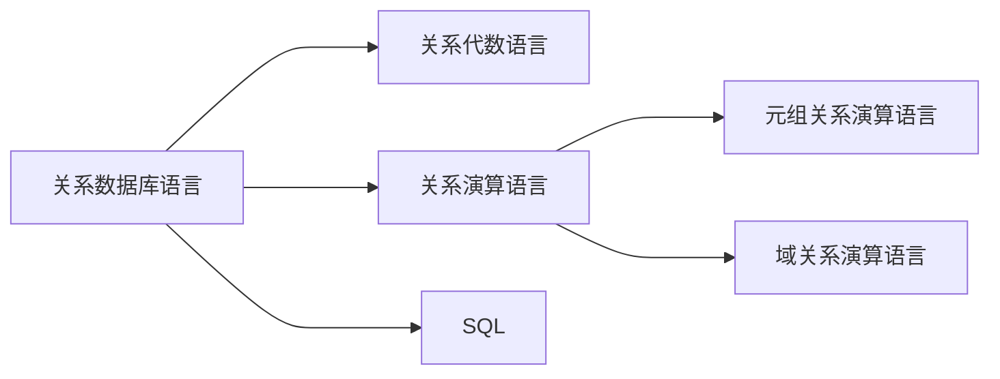

> 书真烂

## 2.1 关系数据结构的形式化定义

### 2.1.1 关系

我们主要有下面三个定义

1. 域
2. 笛卡尔积
3. 关系

#### 域

域通常是一个集合。例如，该域是生物，就表示域中的数据都是生物。其侧重点在与表示出一个数据的范围。用通俗的语言来说，是一个属性的取值范围。

#### 笛卡尔积

首先阐述什么是笛卡尔积。

假如我们一条消息可以由几个值描述。

例如我们对于一个植物我们可以由以下集中分类

| 是否是水果 | 学名 | 市场价格 |
| ---------- | ---- | -------- |
| 是/否      | .... | ￥/ kg   |

我们可以通过一个图的形式来表述。

其中所有相邻的集合之间我们左边集合的每一个元素都与右边所有的元素相连。

我们从左边出发到达右边就是我们笛卡尔积中的一个元素。

例如 `[是 | 梨花 | 100.0]` 就是在笛卡尔积中的一个元素 ，我们将上图的所有路径都记录下来形成一张表就是我们最终的笛卡尔积。

| 是否是水果 | 学名 | 价格 |
| ---------- | ---- | ---- |
| 是         | 苹果 | 0.1  |
| 是         | 苹果 | 0.2  |
| 否         | 苹果 | 0.1  |
| 是         | 梨花 | 10.1 |
| ...        | ...  | ...  |

这样所有的东西组成的一张表就是我们最终的结果。

我们从列开始，从左到右每列都定义出一个**域**，分别为 $D_1 , D_2 , D_3$ 。上面的表格可以称为 $D_1\times D_2\times D_3$ 。每一行的元素我们则称为 $(d_1,d_2,d_3)$ 其中 $d_i$ 为 $D_i$ 中的一个取值。

有了这些，我们就有了笛卡尔积的定义。

$$
D_1\times D_2 \times D_3 ... D_n = \{(d_1,d_2,d_3,...,d_n) | d_i \in D_i , i = 1,2,...,n\}
$$
对于每一个 $(d_1,d_2,...,d_n)$ 我们都称之为**元组** ， 其中由 $n$ 个元素，因此我们也可以称之为 **$n$ 元组**

对于其中的 $d_i$ 我们则称之为 **分量**。

一个域允许取数的范围 $m_i$ 我们称之为**基数**

对于一个 $D_1\times D_2 \times D_3 ... D_n$ 的基数 $M = \prod\limits_{i=1}^n m_i$

#### 关系

首先由定义 $D_1\times D_2\times D_3 \dots D_4$ 的子集为在域 $D_1,D_2,D_3...D_n$ 上的关系。可以表示为 $R(D_1,D_2,...,D_n)$

在上表中，我们可以发现，笛卡尔积中大量存在无意义的东西。因此我们操作通常都是很小的一部分的子集。

那么对于这部分的子集我们可以有以下几个概念。

对于一些**属性组**，如果能够唯一标示出每一个元组。我们称为**候选码**。

如果存在多个候选码的话，我们通常选定一个作为**主码**。

对于所有候选码我们可以称为**主属性**，否则称之为**非主属性**。

特别的，对于候选码包含了其所有的属性时，我们称为**全码**。

最后，对于一张表格而言，其行的上下顺序是不重要的，其列的左右顺序也是不重要的。以及，表中表的形式不应该出现在关系数据库里。

### 2.1.2 关系模式

通常我们的关系模式可以描述为以下的公式。

$$
R(U,D,DOM,F)
$$
我们一个一个来看这些到底表示什么。

- $U$ 表示属性的集合
- $D$ 表示所有属性的域
- $DOM$ 则表示 $U$ 中每个属性对应的 $D$ ，域。
- $F$ 则表示各个属性之间的依赖的关系

### 2.1.3 关系数据库

换句话就是说，关系数据库是关系的数据库。

例如原来是，`[学生 | 导师]` 是一个关系。

这个关系通常来说，也可以理解为一个值。

那么关系数据库就是这个值的数据库。

### 2.1.4 关系数据库的存储结构

讲了，但是没讲。
{:.error}

## 2.2 关系操作

### 2.2.1 几种操作。

`[选择 | 投影 | 连接 | 除 | 并 | 差 | 交]`
{:.success}

### 2.2.2 关系数据库语言的分类

几种分类而已。

## 2.3 关系完整性

关系模型中主要有三种关系完整性

1. 实体完整性
2. 参照完整性
3. 用户定义完整性

### 2.3.1 实体完整性

所谓的实体完整性意味着表中每个数据都是相互独立的，因此我们必须要有一个区分他们存在的码，并且这个码的值不能为空。

比如下述两种完整性约束

$$
学生(\underline{学号},姓名,性别,专业号,年龄) \\
选修(\underline{学号,课程号},成绩)
$$

其中画出下划线都是每个关系中必不可缺少的部分。

### 2.3.2 参照完整性

就上面的两个关系而言。通常我们还有一个 _引用_ 的操作。

比如下面三个关系发现除主码外可以相互引用。

$$
学生(\underline{学号},姓名,性别,专业号,年龄) \\
课程(\underline{课程号}，课程名称)\\
选修(\underline{学号,课程号},成绩)
$$

因此我们可以得出下面的定义

对于两个关系 $R(K_R,F,...)$ $S(K_S , ... )$ 。 $K$ 为**主码**，$F$ 为**非主码**(可以为$K$种的一个子属性)。此时如果我们有 $F = K_S$ 那么此时，$F$ 可以称为**外码**。

此时，对于这两种关系我们称 $R$和$S$ 为**参照关系**与**被参照关系**。

通常存在参照关系的时候，我们的$F$有下面的约束。

- $f$ 的值为空，表示不存在。
- $f$ 为 $F$ 的值域种的值。

## 2.3.3 用户定义的完整性

用户定义的完整性**？**
{:.warning}

## 2.4 关系代数

我们有以下几种运算。

| 运算符   | 含义     | 操作                                                         |
| -------- | -------- | ------------------------------------------------------------ |
| $\cup$   | 并       |                                                              |
| $-$      | 差       |                                                              |
| $\cap$   | 交       |                                                              |
| $\times$ | 笛卡尔积 | 把两个分别看作一个元素进行笛卡尔积                           |
| $\sigma$ | 选择     | 选择一些属性组，满足一些条件                                 |
| $\prod$  | 投影     | 选择列，并删除重复                                           |
| $\Join$  | 连接     | 笛卡尔积，并保留共同的属性，删去多余的(自然连接时不删)       |
| $\div$   | 除       | 选择属性相同的部分，$R$ 中必须把 $S$ 全包，留下不包含 $S$ 的属性组 |

