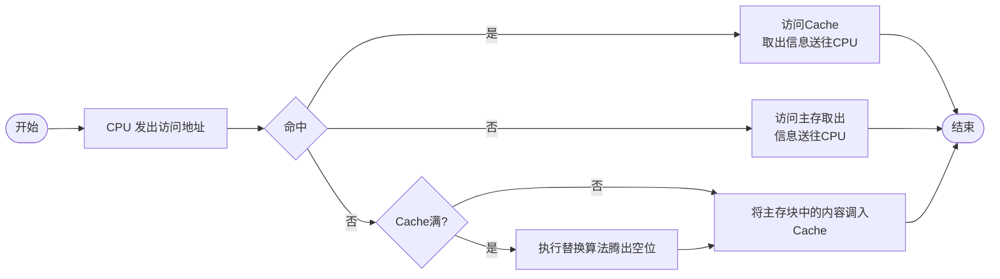

~~~yml
content : 考试相关
target  : exam
edit    :
  - version   : 'v1.0'
    edit_time : 2022-04-27
    message   : "新增第 一\三 章的总结"
  - version   : 'v1.1'
    edit_time : 2022-04-28
    message   : "新增第四章总结"
~~~

## 计算机组成原理概论

### 1. 软硬件的概念

~~~mermaid
flowchart LR;
A["计算机系统"] ---> B["硬件"] & C["软件"]
C ---> D["系统软件"] & E["应用软件"]

~~~

可以简单将软硬件看作一个层次结构，**硬件为软件提供接口，系统软件又为应用软件形成接口，来完成不同的程序。**

计算机系统结构定义了**软硬件的交界面**，即哪些由软件完成，哪些由硬件完成。

计算机组成： 实现计算机体系结构所体现的属性，即具体**指令的实现**

### 2. 计算机的基本组成

#### 1. 冯诺依曼结构

主要有以下的特点

- 五大部件
- 中心为运算器
- 指令和数据存储相同
- 一个指令分为两部分，操作码和地址码。

#### 2. 现代计算机结构

现代计算机结构同冯诺依曼结构类似，只不过将中心由运算器改为了存储器。变动主要由，数据优先输入到存储器中，运算器只处理存储器中的东西 。

从内到外依次为：CPU，主机，硬件。

具体如下

#### 存储器的基本组成

#### 运算器的基本结构

基本如下

其中 X 为取出的数据

#### 控制器的基本结构

- PC (程序计数器) 加一，走到下一步指令，取出
- IR（指令寄存器）存放指令，然后送至CU
- CU（控制单元）分析指令，并操作

#### 完成一条指令的过程

1. PC + 1
2. MAR 存地址
3. MDR 去数据
4. 数据送至 IR
5. IR 送至 CU
6. 同时将数据地址送至 MAR
7. MAR 寻找数据
8. MDR 存数据
9. CU控制，将数据送至 ACC

### 3. 计算机硬件指标

- 机器字长： 一次处理数据的位数
- 运算速度：主频、核数以及每个核支持的线程数、CPI（执行一条指令所需的时钟周期数）、MIPS（每秒执行百万条指令）、FLOPS（每秒浮点运算次数）。
- 存储容量：主存容量（可使用存储单元个数×存储字长来表示存储体容量，MAR * MDR）（也可使用字节数来表示）、辅存容量（字节数表示）。

## 系统总线

总线是连接各个部件之间的信息传输线，是各个部件之间传输信息的介质。

### 总线上的信息传送

有两种传输的方式

- 串行  一条线进行传输
- 并行  多条线进行传输

> 在现代计算机中多采用串行方式，因为现代计算机的时钟频率已经非常的高了，串行会相互影响

### 总线结构的计算机举例

单总线的计算机结构。

双总线就是在主存和 CPU 之间插入一条 M总线

### 总线的分类

1. 片内总线： **芯片内部**的总线
2. 系统总线： **实现计算机各个部件**之间的传输
   1. 数据总线  **双向**  与机器字长、存储字长相关
   2. 地址总线  **单向**  
   3. 控制总线 **入、出**
3. 通信总线  用于**计算机系统**之间或**其它系统**的通信

### 总线的特性和性能指标

总线在主板上，其他设备插入到主板上

1. 机器特性 大小、形状、**管脚数**、**排列顺序**
2. 电器特性  传输方向、有效**电平**范围
3. 功能特性   传输的功能
   1. 地址
   2. 数据
   3. 控制
4. 时间特性 信号和**时序**的关系

#### 总线的性能指标

1. 宽度
2. 标准传输速率
3. 时钟 同步/异步
4. 总线复用
5. 信号线数
6. 总线控制方式
7. 其他指标

#### 总线标准

### 总线结构

1. 双总线结构

   

2. 三总线结构

   

   高速设备通过 DMA 总线进行传输

3. 三总线变种

   

还有许多都大同小异，就不一一放了。

 

### 总线控制

#### 总线判优控制

1. 基本概念
   - 主设备  对总线具有**控制权**
   - 从设备  **响应**主设备的命令
   - 总线判优控制
     - 集中式
       - 链式查询
       - 计数器定时查询
       - 独立请求方式
     - 分布式

#### 链式查询方式

通过 BR 申请，BG同意，同意的设备占用BS其他设备此时无法使用

- 优点
  - 结构简单
  - 易于扩展
- 缺点
  - 优先级固定
  - 容易坏

#### 计数器定时查询方式

将链式换位计数器轮询的方式

- 优点
  - 不易受到影响
  - 轮询的方式

#### 独立请求方式

通过排队器来确定优先级，不过线数较多。

### 总线通信控制

1. 目的 ， 解决通信双方**协调配合**的问题
2. 传输的周期
   1. 申请分配阶段 **主模块**申请，总线仲裁
   2. 寻址阶段         主模块向从模块**给出地址**和**命令**
   3. 传数阶段         
   4. 结束阶段         主模块**撤销**相关信息
3. 总线通信的四种方式
   - 同步通信  由统一时标控制数据传送
   - 异步通信  采用应答方式，没有公共时钟标准
   - 半同步通信  同步异步相结合
   - 分离式通信

异步通信有三种形式

~~~
过程如下:
主设备请求 ---> 从设备应答 ---> 主设备撤销 ---> 从设备停止
    1~~~~~~^             2~~~~^        3 ~~~~^
~~~

- 不互锁  1
- 半互锁  12
- 全互锁  123

## 存储器

### 概述

按照作用分类

CPU 的层次结构

~~~mermaid
flowchart LR
A[CPU]
B[缓存]
C[主存]
D[辅存]

A <---> B & C
B <---> C
C <---> D
~~~

### 主存储器

#### 概述

结构通常如下

主存储器的技术指标

1. 存储容量=存储单元个数$\times$存储字长
2. 存储速度
   - 存取时间又称为存储器访问时间，一次**启动到完成**的全部时间
   - 存储周期，指连续两次独立的存储操作的**最小间隔**。
3. 存储器带宽

#### 主存储器半导体芯片简介

##### 基本结构

1. 片选信号$\overline{CS}$(低电平有效)  $\overline{CE}$（使能型号)
2. 读写
   1. $\overline{WE}$ 低电平写，高电平读
   2. $\overline{OE}$ 读 $\overline{WE}$ 写
3. 片选线表示选择哪一个，可以利用片选型号进行扩展

##### 半导体存储芯片的译码驱动方式

1. 线选法

   用一个 `m:n` 译码器进行选择

   有点事简单，缺点是线多

2. 重合法

   将一个数字变成两个部分，加入一个数字是 `aaaabbbb` 那么 `X` 轴的信号为 `aaaa` ,`Y` 轴的信号为 `bbbb` 那么`XY` 轴一起选中就是这个地质单元。

   

#### 随机存取存储器

##### 静态RAM (Static RAM)

大致原理如图

其他所有操作同上。

##### 动态 RAM (Dynamic RAM)

特点

- 利用电容保存电荷
- **写入信息与输入相同**
- **读出信息与存储信息不同**，需要添加非门

还有一种是单管的 RAM

由于电容会漏单的缘故，因此需要刷新放大器对存储信息进行定时刷新

动态 RAM 的刷新：

- 每次刷新只与**行地址**相关，每次刷新一次
- 集中刷新：在一段时间内集中刷新，在这段时间内不可用，即死区。
- 分散刷新，在读写操作中刷新，读写操作时间变长，拖慢速度。
- 异步刷新：结合起来，每隔一段时间对某一行进行刷新，多个读写操作加一个刷新操作。

##### 比较

|          | DRAM | SRAM   |
| -------- | ---- | ------ |
| 原理     | 电容 | 触发器 |
| 集成度   | 高   | 低     |
| 芯片引脚 | 少   | 多     |
| 功耗     | 小   | 大     |
| 价格     | 低   | 贵     |
| 速度     | 慢   | 快     |
| 刷新     | 刷   | -      |

#### 只读存储器 ROM (Read Only Memory)

- 掩模 ROM(MROM) : 只读，不可修改
- PROM (一次性编程 ROM) ： 熔丝 ROM
- EPROM(有限多次编程) ： 紫外线消除浮动栅
- EEPROM (多次编程) ： 电擦，电写
- 闪存 ： 快，部分的RAM 功能

#### CPU 与存储器的连接

- 地址线： **地位地址 ，高位片选**
- 数据线
- 读写

看图就好了

#### 存储器的校验

首先有一个公式

$$
L-1=D+C (D\ge C)
$$
L 为最小距离，D 为检错位数，C 为纠错位数

汉明码采用奇校验

以一定范围内所有的 $2^k$ 和 $0$ 作为校验位，然后异或和就是位置，如果与 0 不符合，则存在多个错误。

#### 提高主存的访问和存储速度

- 高速硬件
- 层次 `Cache - 主存`
- 调整结构

有如下系统的调整

- 单体多字系统
  - 实现： 一次取出多位数据放入内存之中
  - 优点
    - 增加存储器的带宽
  - 缺点
    - 冗余多余的位，可能带来错误
    - 实现复杂
    - 非连续的地址拿取较慢
- 高位交叉
  - 实现：假若有多个存储体，每个存储体是连续编址的即 `[体号|体内地址]`的形式
  - 优点
    - 有并行的基础
    - 易于提高存储容量
  - 缺点
    - 通常程序是顺序执行的，所以可能大多数的执行都在读取一个存储体
- 地位交叉
  - 实现：与高位交叉相反
  - 优点
    - 不改变存取周期的前提下，增加存储器的带宽
  - 缺点
  - 时间：$T+(4-1)\tau$

##### 高性能存储芯片

1. SDRAM
2. RDRAM
3. 带 Cache 的 DRAM

### 高速缓冲存储器

#### 概述

因为存取速度和计算速度不匹配，所以中间用一层缓存来加快计算速度

程序访问的局部性原理：

- 时间局部性：当前正在使用的指令或数据，会在不久的将来还会使用到，那么应该把这种数据或指令放在缓存中。
- 空间局部性：当前正在使用的指令或数据，不久的将来，相邻的指令或数据会使用到，那么应该把当前和相邻的指令和数据放到缓存中。

##### Cache 的工作原理

1. 由于Cache的大小远远小于主存，因此，将主存Cache划分为多个和**大小相等的块**。然后 Cache + 在相应的块上标记出主存的地址，就知道对应哪块地址了。
2. 如果主存调入了Cache，就称为命中，否则未命中。

##### Cache 的基本结构与读写操作

读

写

- 写直达法(Write-through)

  写操作的时候既写入Cache又写入主存

  写操作时间就是访问主存的时间

  更新策略容易实现

- 写回法

  写操作的时候只把数据写入Cache而不写入主存

  Cache数据替换出去的时候才写回主存

##### Cache 改进

1. 增加 Cache 级数
2. 统一缓存和分立缓存

#### Cache-主存的地址映射

##### 直接映射

主存中任意一个快，**只能映射到 Cache 中一个块**，Cache 则是一对多。在Cache 中有 t 位标记，表示该 cache 存储的到底是哪个块的信息。

该映射方式的命中率低，并且容易冲突

##### 全相联映射

类似卷积，Cache的块和主存中的块组成一个完全二分图

存储效率变高，但是带来的是**检测**的时候性能下降。速度慢

##### 组相联映射

是结合上面两种映射方式的折中办法。

#### 替换算法

1. 先入先出(FIFO)算法

2. 近期少用(FRU)

