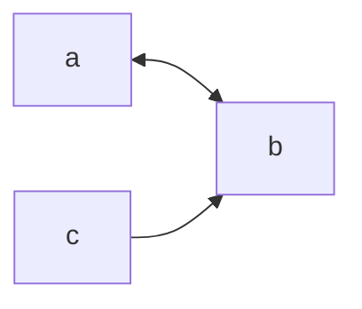

## A - Villages: Landlines

题意简述，给出一些区间，求取最多添加多长的区间使得这些区间合并。

非常简单，按题意模拟即可。

```cpp
#include <algorithm>
#include <iostream>
#include <vector>

using namespace std;

int main() {
   int n;
   cin >> n;

   vector<pair<int, int>> v(n);

   for (auto &[x, y] : v) {
      int m, r;
      cin >> m >> r;
      x = m - r, y = m + r;
   }

   sort(v.begin(), v.end());

   int m = v[0].first;

   int ans = 0;

   for (auto [l, r] : v) {
      if (l > m) {
         ans += l - m;
         m = r;
      } else {
         m = max(m, r);
      }
   }

   cout << ans << '\n';

   return 0;
}
```

## C - Grab the Seat!

题意简述。

在一个矩形的教室中，有一块屏幕，我们要求取在所有座位中，可以直接看到屏幕而不被遮挡的座位的数量。

看图


我们将两条端点进行连线，然后我们发现，在所有线后方的点都为无效点。

也是非常的简单。

```cpp
#include <algorithm>
#include <iostream>
#include <vector>

using namespace std;

int main() {
   ios::sync_with_stdio(false);
   int n, m, k, q;
   cin >> n >> m >> k >> q;

   vector<pair<int, int>> point(k);

   for (auto &[x, y] : point) cin >> x >> y;

   auto calc = [](auto start, const auto end, auto step) -> void {
      int y = 0;
      *step = min(*step, *start - 1ll);
      y++, step++, start++;
      long long a = 0, b = 0;

      for (auto it = start; it != end; ++it, ++y, ++step) {
         auto x = *it;
         if (1ll * a * y >= 1ll * b * x) {
            a = x;
            b = y;
         }

         *step = min(*step, (a * y - 1) / b);
      }
   };

   vector<long long> rows;
   vector<long long> ans;

   while (q--) {
      ios::sync_with_stdio(false);
      cin.tie(0);
      int p, x, y;
      cin >> p >> x >> y;
      point[p - 1] = {x, y};
      rows.assign(m, 1e9);
      ans.assign(m, n);
      for (auto &[x, y] : point) {
         rows[y - 1] = min(rows[y - 1], x * 1ll);
      }

      calc(rows.begin(), rows.end(), ans.begin());
      calc(rows.rbegin(), rows.rend(), ans.rbegin());

      long long sum = 0;

      for (auto x : ans) sum += max(0ll, x);

      cout << sum << '\n';
   }

   return 0;
}
```

## D - Mocha and Railgun

强烈建议看这个[题解](https://blog.nowcoder.net/n/e53044d543e243788225d191079490ad),图文并茂，本人就不在给予过多的解释了。

## G - Lexicographical Maximum

签到题，不做太多解释。

```cpp
#include <iostream>

using namespace std;

int main() {
    string s; cin >> s;
    bool f = true;
    for (int i = 0 ; i != s.length() - 1 ; i ++ ) {
        if(s[i] == '9');
        else {f = false; break;}
    }
    
    if(f) cout << s << '\n';
    else for (int i = 0 ; i != s.length() - 1 ; i ++ ) {
        cout << 9 ;
    }
    
    
    return 0;
}
```


## I - Chiitoitsu

概率期望题目

稍微详细解释一下。

假如我们开局手中有 `x` 张未凑成对子的牌，在牌堆中一共有 `y` 张牌，在题目中有明说采取 `optimal strategy`。

因此照着最优解考虑即可。

我们摸到的牌只有两种可能。

1. 摸到的牌是 `x` 张牌中的一张。
2. 不是 `x` 张牌的对子。

我们定义概率的期望为 $f(x,y)$

那么第一种情况可以拆分为以下几个部分。

1. 摸到这张牌之后，我们发现，我们把这张牌凑了对子， `x - 1`，随后我们又丢弃一张，`x - 1`。一共是 `x - 2`。
2. 同时牌堆中的牌仅仅少了一张，因此为 `y - 1`。
3. 由于我们在牌堆中抽到我们需要的 `x` 张牌中的对子的概率为 $\frac{x * 3}{y}$。

以上可以得到 $f(x,y)$ 的一个部分是 $f(x - 2 , y - 1)$ 并且有 $\frac{x * 3}{y}$ 的概率拿到手。

对于第二种情况就更简单了。

把拿到的牌直接扔掉即可。所以第二种情况是 $f(x , y - 1)$。


由于我们当前抽到一张牌需要移动一次，因此我们需要在进入下一个 $f(x,y)$ 的时候做出一步的动作。

那么最终的结果是

$$
f(x,y) = \frac{x \times 3}{y} f(x - 2 , y - 1) + \frac{y - x\times 3}{y} f(x , y - 1) + 1
$$

最后我们的代码就是

```cpp
#include <iostream>
#include <set>
#include <vector>
using namespace std;

const int MOD = 1e9 + 7;
long long Q_power(long long a, long long b = MOD - 2,
                  long long m = MOD) {
   long long res = 1;
   while (b) {
      if (b & 1) res = res * a % m;
      a = a * a % m;
      b >>= 1;
   }
   return res;
}

long long record[14][136];

long long dfs(int need, int last) {
   if (need < 0) return 0;

   if (record[need][last]) return record[need][last];

   long long res = 1;

   res += need * 3 * Q_power(last) % MOD *
          dfs(need - 2, last - 1) % MOD;
   // need * 3 / last * step(...)

   if (last > need * 3)
      res += (last - need * 3) * Q_power(last) % MOD *
             dfs(need, last - 1) % MOD;
   // (last - need * 3) / last * step(...)

   res %= MOD;
   return record[need][last] = res;
}

int main() {
   ios::sync_with_stdio(false);
   cin.tie(0);

   int T;
   cin >> T;
   for (int i = 1; i <= T; i++) {
      string s;
      cin >> s;
      set<string> dict;
      for (int i = 0; i < 13; i++) {
         string t = "";
         t += s[i * 2];
         t += s[i * 2 + 1];
         dict.insert(t);
      }
      cout << "Case #" << i << ": "
           << dfs(dict.size() * 2 - 13, 34 * 4 - 13) << '\n';
   }
}
```


## J - Serval and Essay

用并查集不断的合并，跑了一个暴力就过了~

不过，这个程序在证明上是错的。

我们现在像这样建图

1. 首先我们只放置点 1
2. 然后我们每次放一个点，就和点 1 和上一个放置的点连起来。
3. 最终像我这样一直建立起来所有的点。

给出一张例图。


我们可以发现，如果采用这种方式做的话，每次必须同时完成上一个点的合并才可以进行下一次。

最终，我们发现时间复杂度是 $O(N)$

如果我们不对其进行随机化处理的话，假若我将图的顺序完全颠倒过来，那么也就意味着每次只能合并一个点，而一共 $N$ 个点，最终的时间复杂度是 $O(N^2)$。

```cpp
#include <iostream>
#include <vector>

using namespace std;

vector<int> fa, sz;

const int N = 2e5 + 10;

vector<int> F[N];

int find(int x) {
   if (x == fa[x]) return x;
   return fa[x] = find(fa[x]);
}

void merge(int x, int y) {
   x = find(x), y = find(y);
   sz[x] += sz[y];
   fa[y] = x;
}

int solve() {
   int n;
   cin >> n;

   fa.resize(n);
   sz.assign(n, 1);

   for (int i = 0; i < n; i++) fa[i] = i;

   for (int i = 0; i < n; i++) {
      F[i].clear();
      int k;
      cin >> k;
      for (int j = 0; j < k; j++) {
         int x;
         cin >> x;
         x--;
         F[i].push_back(x);
      }
   }

   while (true) {
      bool bk = true;
      for (int i = 0; i < n; i++) {
         int f = -1;
         for (auto v : F[i]) {
            if (f == -1) {
               f = find(v);
            } else if (f != find(v)) {
               f = -1;
               break;
            }
         }

         if (f != -1 && find(i) != find(f)) {
            bk = false;
            merge(f, i);
         }
      }

      if (bk) break;
   }

   auto ans = 0;

   for (auto x : sz) ans = max(ans, x);

   return ans;
}

int main() {
   cin.tie(0)->sync_with_stdio(false);
   int t;
   cin >> t;

   for (int i = 1; i <= t; i++)
      cout << "Case #" << i << ": " << solve() << '\n';

   return 0;
}
```

因此，我们需要另外的算法，启发式合并。

每次，我们获得一条边 `x --> y`

假如我们将 `x` 点出发的边合并到点 `y` 。那么我需要把所有从 `x` 点出发的点合并到 `y` 上，由于我们采用并查集将这两个点合并掉了，因此，此后，我们就不在访问到点 `x` 了，所以，`To[x]` 在合并后就没有用了，我们只需要 `From[v]` 即可。

但是，有一点我们需要注意，我们的 `From[y]` 中，并不能将 `x` 点删去，我们需要保留点，以保证这个点可能有多个点合并而来。

因为我们可能会出现如下的情形。



假如我们合并之后，`From[b]` 就变成一个了，会造成 `c` 和 `b` 进行合并，而实际上 `c` 并不能推断出 `b` 来。

```cpp
#include <iostream>
#include <set>
#include <vector>
using namespace std;

const int N = 2e5 + 10;

set<int> From[N], To[N];
vector<int> f, sz;

int find(int x) {
   if (x == f[x]) return x;
   return f[x] = find(f[x]);
}

int get_sz(int u) { return To[u].size(); }

void merge(int x, int y) {
   x = find(x), y = find(y);
   if (x == y) return;

   if (get_sz(x) > get_sz(y)) swap(x, y);

   f[x] = y;
   sz[y] += sz[x];

   vector<pair<int, int>> que;

   for (auto v : To[x]) {
      From[v].erase(x), From[v].insert(y);
      To[y].insert(v);
      if (From[v].size() == 1) que.push_back({v, y});
   }

   for (auto [a, b] : que) {
      merge(a, b);
   }
}

int solve() {
   int n;
   cin >> n;

   f.resize(n);
   sz.assign(n, 1);

   for (int i = 0; i < n; i++)
      From[i].clear(), To[i].clear(), f[i] = i;

   for (int i = 0; i < n; i++) {
      int k;
      cin >> k;

      for (int j = 0; j < k; j++) {
         int x;
         cin >> x;
         x--;
         From[i].insert(x);
         To[x].insert(i);
      }
   }

   for (int i = 0; i < n; i++) {
      if (From[i].size() == 1) {
         merge(*From[i].begin(), i);
      }
   }

   int ans = 0;

   for (auto v : sz) {
      ans = max(ans, v);
   }
   return ans;
}

int main() {
   cin.tie(0)->sync_with_stdio(false);
   int t;
   cin >> t;

   for (int i = 1; i <= t; i++)
      cout << "Case #" << i << ": " << solve() << '\n';

   return 0;
}
```


