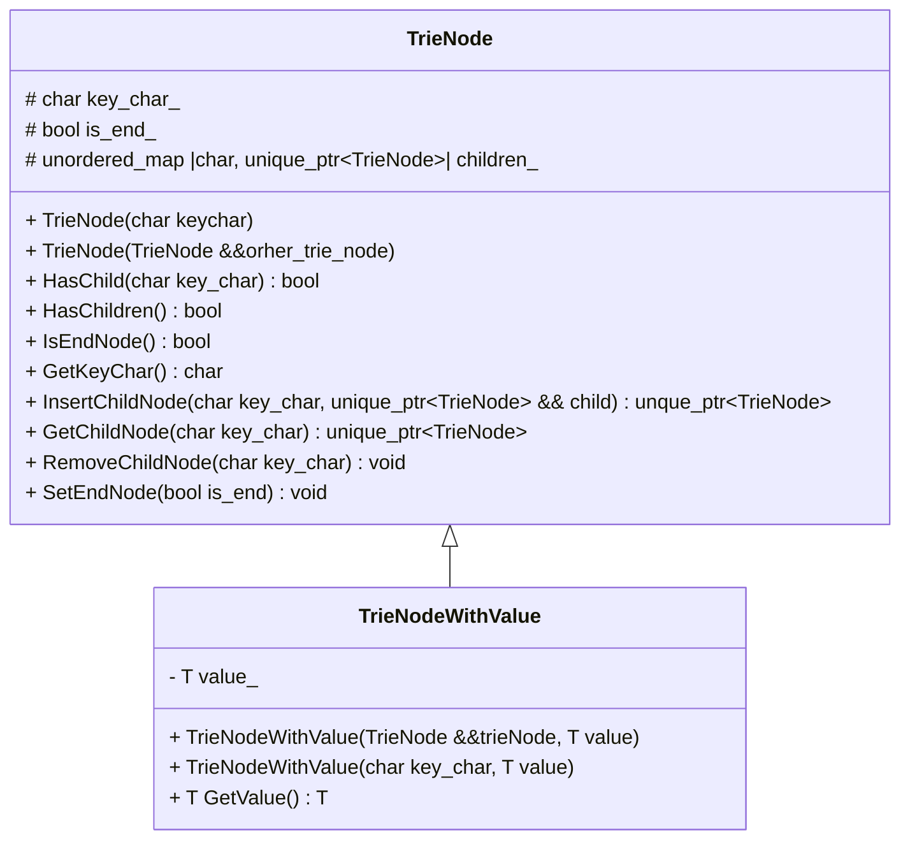
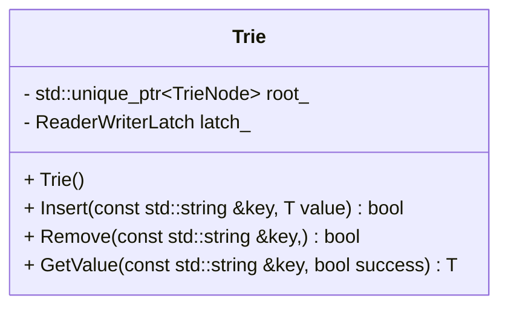

## 实验目标

该实验为 `CMU 15-445/645` 的前置实现。主要考察 C++ 使用的功底。

我所采用的课程为 [fall2022](https://15445.courses.cs.cmu.edu/fall2022/)[^cmu_15445_fall2022] 相关代码可以在 [Release](https://github.com/cmu-db/bustub/releases/tag/v20221128-2022fall)[^bustub_source_code] 中下载

[^cmu_15445_fall2022]: CMU 15-445/645 fall2022 官方网址 <https://15445.courses.cs.cmu.edu/fall2022/>
[^bustub_source_code]: bustub 源码地址 <https://github.com/cmu-db/bustub>


该课程主要涉及到两方面内容

- 如何搭建环境
- C++的使用







## 环境的搭建

我采用的是使用虚拟机(Ubuntu) + 本地电脑ssh 的开发方式。

vscode 中安装如下几个插件

- `C/C++`
- `CMake`
- `CMake Tools`
- `Remote - SSH`

首先我们首先需要下载并解压所需要的 [代码](https://github.com/cmu-db/bustub/releases/tag/v20221128-2022fall)

```shell
wget https://github.com/cmu-db/bustub/archive/refs/tags/v20221128-2022fall.tar.gz
tar -zxvf v20221128-2022fall.tar.gz  
```

然后直接用 `VScode` SSH直接进入远程的电脑的当前目录下。

之后安装必要的软件

```shell
sudo build_support/packages.sh
```

之后看 Vscode 几个选项需要我们设置一下

<div id="tmp_tag"></div>


我们点击最下方的 

[<i class="fa-solid fa-gear fa-beat"></i> 生成](#tmp_tag){:.button.button--outline-secondary.button--pill}


然后选择 `Clang 12.01 x86_64-pc-linux-gnu` 即可愉快的coding了。

### Debug 

在 <i class="fa-solid fa-gear fa-beat"></i> 生成旁边有个按钮 `[all]` 把他切换为你所需要的那个就可以了。

  

所采用的测试方法为 `GTest` 

只需要将目标 Test 文件下的 `DIABLE_` 删除就可以进行 Test 了 

例如在路径 `/test/primer/starter_trie_test.cpp` 将所有 `DIABLE_` 删除，之后就可以尝试输出结果，按 <i class="fa-solid fa-bug"></i> 就可以在自己打的断点进行调试。按 <i class="fa-solid fa-play"></i> 就可以直接出结果

> <i class="fa-solid fa-bug"></i> 调试
>   

> <i class="fa-solid fa-play"></i> 运行结果
>   


## C++ 的使用

这方面到没有太多可以讲的。

主要抓住 `std::unique_ptr` 的用法就可以了。

下面是几个个使用的例子。

遍历字典树的节点
```cpp
auto cur_node = &this->root_; // ! 指向智能指针的指针
auto par_node = cur_node;

while(cur_node != nullptr) {
  cur_node = cur_node->get()-> GetChildNode(ch);
  ...
  par_node = cur_node;
}
```

如何在父类指针上动态构建子类节点

```cpp
auto tmp_node = std::make_unique<T>(std::move(*cur_node) , value);
par_node-> get() -> InsertChildNode(ch, std::move(*tmp_node));
cur_node = par_node-> GetChildNode(ch);
```


通过强制转换得到子类空间的值
```cpp
auto tmp_node = dynamic_cast<TrieNodeWithValue<T> *>(cur_node->get());
```

由于课程已经结束了，实在无法完成的话，可以参考我的[代码](/assets/others/CMU15445_project_0_c++_prime.cpp)。