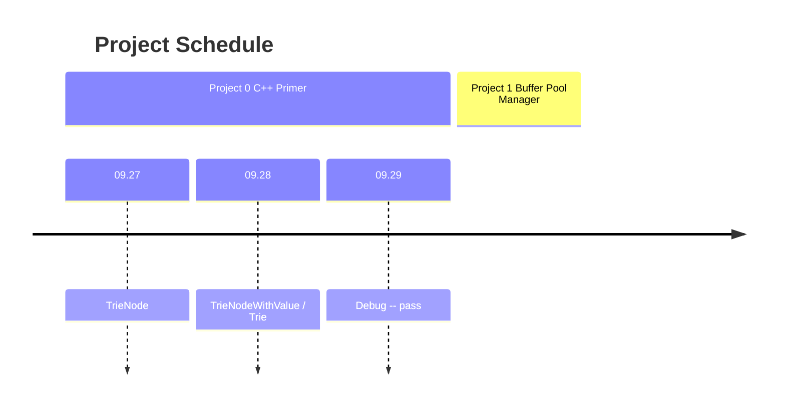
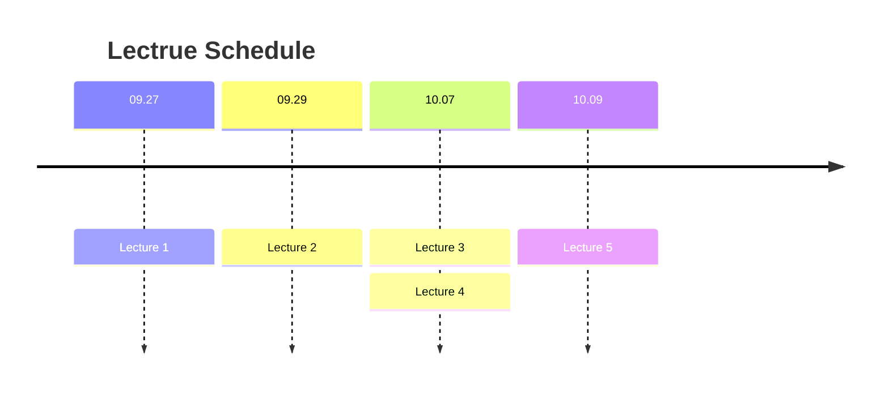

<iframe style="border-radius:12px" src="https://open.spotify.com/embed/track/5mg3VB3Qh7jcR5kAAC4DSV?utm_source=generator" width="100%" height="152" frameBorder="0" allowfullscreen="" allow="autoplay; clipboard-write; encrypted-media; fullscreen; picture-in-picture" loading="lazy"></iframe>

## Fall2022 Project

### Project # 0 - C++ Primer

[<i class="fa-solid fa-database"></i> Project # 0 C++ Primer](/cmu15-445/2023/09/27/CMU15445-project-0.html){:.button.button--outline-secondary.button--pill}

- 环境配置
- C++ 基础语法

参考:
 - 写给[C++ ]新人智能指针避坑指南 <https://www.luozhiyun.com/archives/762>
 - 一文带你详细介绍c++中的`std::move`函数 <https://www.cnblogs.com/shadow-lr/p/Introduce_Std-move.html>
 - Introduction to C++11 and C++14 with Example Code Snippet <https://www.thegeekstuff.com/2016/02/c-plus-plus-11/>
 - CMU 15445 vscode/clion clang12 cmake环境配置 <https://zhuanlan.zhihu.com/p/592802373>

### Project # 1 - Buffer Pool Manager

### Project # 2 - B+ Tree Index Checkpoint 1

### Project # 2 - B+ Tree Index Checkpoint 2

### Project # 3 - Query Execution

### Project # 4 - Concurrency Control

------

## Fall2022 Lectrue

