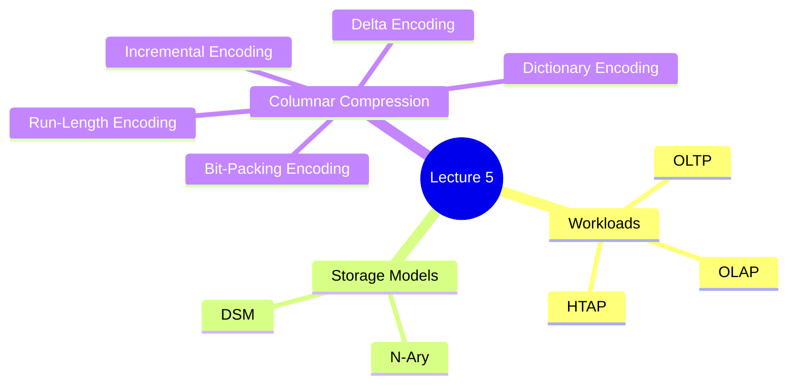

[refer to Slide](https://15445.courses.cs.cmu.edu/fall2022/slides/05-storage3.pdf) 

[refer to Note](https://15445.courses.cs.cmu.edu/fall2022/notes/05-storage3.pdf)

## Database workloads

### OLTP

OLTP: On-Line Transaction Processing

每次快速的对一个小范围的数据进行读取、更新的操作。

### OLAP

OLAP: On-Line Analytical Processing

OLAP 是用来支持复杂的分析操作，提供决策支持等

### HTAP

Hybrid Transaction + Analytical Processing

一种新的 workload ，将 OLTP 和 OOLAP 结合起来。

  

----

## Stroage Models

### N-Ary Storage Model (NSM)

在 `n-ary` 的存储模式中，DBMS 连续的存储所有的、包含所有 `arributes` 的 `tuple` 在一个单独的页面中。

这对于 OLTP 来说是十分理想的。

Advantages:
- 插入，更新，删除非常快
- 对于需要整个 `tuple` 的查询非常友好

Disadvantages:
- 对于需要扫描整个表或者只需要一个属性的查询非常不好

> <blockquote class="imgur-embed-pub" lang="en" data-id="zMMWPiu"><a href="https://imgur.com/zMMWPiu">View post on imgur.com</a></blockquote>

### Decompositrion Storage Model (DSM)

将所有 `tuples` 中的每个 `attribute` 单独分出来进行存储

> 也可以成为 “列存储 (column store)”

对于只读的 OLAP 操作非常友好，尤其是那些只需要扫描部分 `attributes` 的操作来说。

<blockquote class="imgur-embed-pub" lang="en" data-id="iONtz5L"><a href="https://imgur.com/iONtz5L">View post on imgur.com</a></blockquote>

Advantages:
- 减少 I/O 的浪费
- 更好的进行查询以及将数据进行压缩

Disadvantages:
- 对于单点修改查询更新这些操作比较慢。

为了实现这种操作通常有两种操作方法。
1. 为每个属性设置固定的字长，这样我们只需要得到 `offset` 就可以准确的查找到我们所需要的数据
2. 一个更为罕见的操作是，使用一个形如 `(id : pos)` 的 tuple 来存储值，表示第 `id` 的值存储在 `pos` 位置上。

<blockquote class="imgur-embed-pub" lang="en" data-id="IedfkNq"><a href="https://imgur.com/IedfkNq">View post on imgur.com</a></blockquote>

## Database Compression

I/O 是非常耗时的，通常是整个数据库的瓶颈，所以 DBMS 中广泛的采用压缩算法来提高 DBMS 的表现。

通常我们需要在 **速度** 和 **压缩率** 之间进行取舍。

### 压缩颗粒度
- Block Level
- Tuple Level 对整个 `tuple` 进行压缩 (NSM Only)
- Attribute Level
- Columnar Level

## Naive Compression

使用 "general-purpose" 的压缩算法通常也是一种解决办法。不过一旦使用着这种方法之后，DBMS 就不知道我们进行操作的数据是什么，直到解压完。

provided as input:  
→ LZO (1996), LZ4 (2011), Snappy (2011),
Oracle OZIP (2014), Zstd (2015)

<blockquote class="imgur-embed-pub" lang="en" data-id="btfm5p9"><a href="https://imgur.com/btfm5p9">View post on imgur.com</a></blockquote>

为了提高速度，我们需要另外的压缩方法，即使是在压缩之后，我们也有办法获取其中的信息来加速。

<blockquote class="imgur-embed-pub" lang="en" data-id="gmB5Ith"><a href="https://imgur.com/gmB5Ith">View post on imgur.com</a></blockquote>

## Columnar Compression

### Run-Length Encoding(RLE)

可以将一些连续出现在同一列上的值压缩成一个形如`(value : pos : num)` 的 `triplets`。

其中:
1. `value` 表示值
2. `pos` 表示该值的起始位置
3. `num` 表示该值重复的次数

<blockquote class="imgur-embed-pub" lang="en" data-id="4UVuuqG"><a href="https://imgur.com/4UVuuqG">View post on imgur.com</a></blockquote>

> 不过该方法可能存在一些缺陷
> 
> <blockquote class="imgur-embed-pub" lang="en" data-id="odwQgWe"><a href="https://imgur.com/odwQgWe">View post on imgur.com</a></blockquote>
>
> 经过转换后
> 
> <blockquote class="imgur-embed-pub" lang="en" data-id="WFfzLgP"><a href="https://imgur.com/WFfzLgP">View post on imgur.com</a></blockquote>

### Bit-Packing Encoding

一些数据对我们来说是十分冗余的，我们可以通过 Bit-Packing 的方式来减少这些冗余。

<blockquote class="imgur-embed-pub" lang="en" data-id="WLI2OFf"><a href="https://imgur.com/WLI2OFf">View post on imgur.com</a></blockquote>

将 `int64` 转换为 `int8` 大大减少了需要的空间。

不过该方法存在一些缺陷，可能会存在部分信息有不符合 `int8` 的信息。

因此，我们需要如下的方式进行存储。

<blockquote class="imgur-embed-pub" lang="en" data-id="K8lQr8R"><a href="https://imgur.com/K8lQr8R">View post on imgur.com</a></blockquote>

不过该方法只能在额外存储信息较少的时候进行使用。

### Bitmap Encoding

当我们每个 `attribute` 较少的时候，我们可以采用 Bitmap 的方式进行存储。

例如，只存在 `F` 和 `M` 两种值的时候，我们就可以是由 `01` 来表示是或者不是。

<blockquote class="imgur-embed-pub" lang="en" data-id="PNmEvKe"><a href="https://imgur.com/PNmEvKe">View post on imgur.com</a></blockquote>

### Delta Encoding

在许多情况下，例如室温多少，我们的统计结果里可能存在较为密集的值在一定的范围内。

因此我们通过确定一个值后，往后的所有值都可以通过 `delta` 的形式存储

<blockquote class="imgur-embed-pub" lang="en" data-id="XQe8W5Y"><a href="https://imgur.com/XQe8W5Y">View post on imgur.com</a></blockquote>

### Incremental Encoding

我们通常也可以通过取 **前缀 / 后缀** 的形式来得到我们的最终结果。

<blockquote class="imgur-embed-pub" lang="en" data-id="oM9zEKa"><a href="https://imgur.com/oM9zEKa">View post on imgur.com</a></blockquote>

### Dictionary Compression

当一张表中可能存在多个值，且这多个值存在在不同的地方，那么我们就可以通过字典的形式得到这些值所在的位置。

<blockquote class="imgur-embed-pub" lang="en" data-id="GgSgrMr"><a href="https://imgur.com/GgSgrMr">View post on imgur.com</a></blockquote>

这也是最常用的压缩方法。

