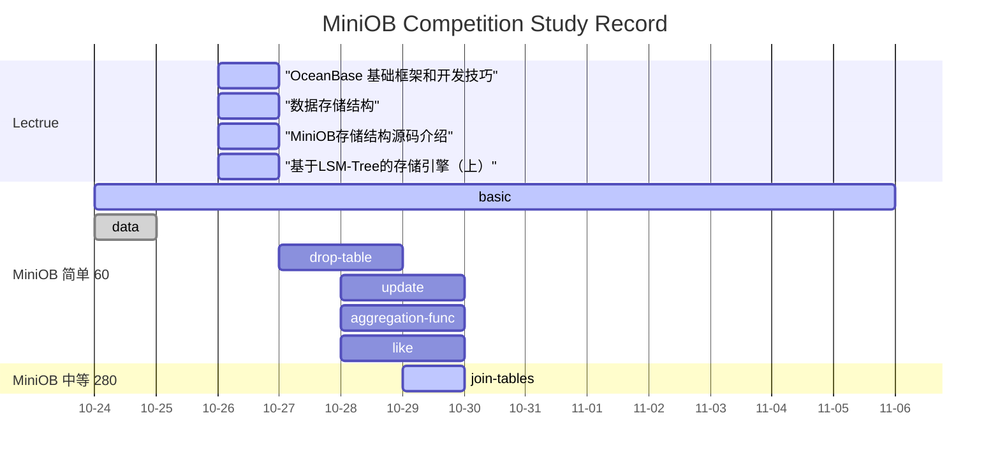

[Refer to](https://open.oceanbase.com/competition)

## timeline

[Lecture Refer to](https://open.oceanbase.com/activities/4922179)

[Project Refer to](https://open.oceanbase.com/train?questionId=600004)

## Lectrue Record

## Project Record

